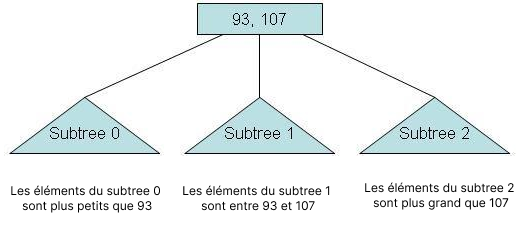
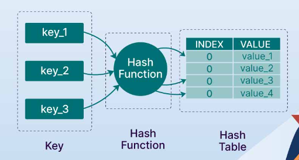
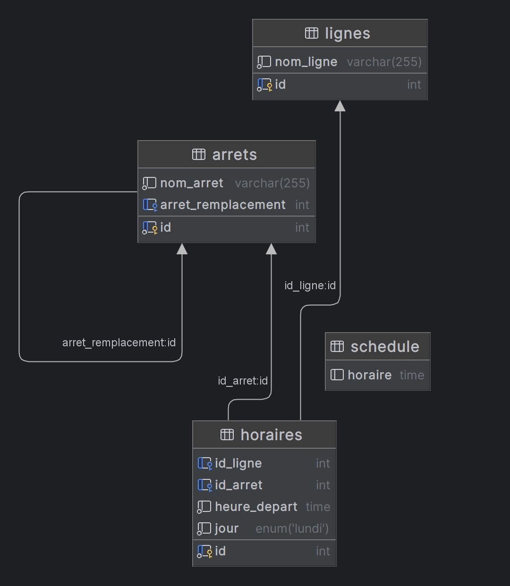

# README.md

# Table des Matières

1. [Introduction](#introduction)
2. [Installation avec Docker](#installation-avec-docker)
3. [Utilisation](#utilisation)
    - [Démarrage avec Docker](#démarrage-avec-docker)
    - [Exécution des Scripts SQL avec Docker](#exécution-des-scripts-sql-avec-docker)
4. [Questions Sans Queries](#questions-sans-queries)
    - [Question 8 Index B-Tree et Hash](#question-8-index-b-tree-et-hash)
    - [Question 9 Création d'index sur colonnes](#question-9-création-dindex-sur-colonnes)
5. [Conception](#conception)
    - [Dictionnaire des données](#dictionnaire-des-données)
    - [Schéma MCD](#schéma-mcd)
5. [Remarques](#remarques)
6. [Références](#références)

## Introduction

(Chaque points dans 'Requêtes' est expliqué dans le fichier `queries.sql` dans l'ordre des questions demandées.)

Ce document sert de guide pour l'installation et l'utilisation du projet SQL pour l'évaluation de Kiceo. Il contient des
instructions pour l'installation et l'utilisation du projet avec Docker, ainsi que des réponses aux questions données sans utiliser de
queries, une conception de base de données et un schéma MCD. Le projet est une base de données pour un système de
transport en commun, avec des tables pour les lignes de bus, les arrêts, les horaires et les horaires de bus.
Ce projet se concentre sur une partie infime de ce qu'un système de transport en commun pourrait être, mais il est
suffisant pour démontrer les compétences en SQL et en conception de base de données. Egalement, le projet ne traite que d'un jour dans la semaine,
à savoir le lundi.

## Installation avec Docker

Pour utiliser ce projet, vous devez avoir Docker et Docker Compose installés sur votre machine. Ils vous permettront de
créer et de gérer des conteneurs pour la base de données MySQL, assurant une isolation et une portabilité accrues.
Suivez ces étapes pour démarrer :

Clonez ce dépôt sur votre machine locale.

## Utilisation

### Démarrage avec Docker

Naviguez dans le dossier du projet où se trouve le fichier docker-compose.yml (à la racine).

Lancez le service de base de données MySQL en exécutant la commande suivante dans votre terminal :

```bash
docker-compose up -d
```

### Exécution des Scripts SQL avec Docker

Pour exécuter des scripts SQL à l'intérieur de votre conteneur MySQL, procédez comme suit :

Assurez-vous que le conteneur MySQL est en cours d'exécution.

```bash
docker ps
```

Placez le script SQL que vous souhaitez exécuter dans le répertoire accessible par Docker (à la racine).

Exécutez le script SQL permettant la création de la structure de la database en utilisant une des commandes suivantes :

Via Bash :

```bash
docker exec -i sql-eval-kiceo-mysql-1 mysql -u root -p'root' eval_kiceo < schema.sql
```

Via PowerShell :

```bash
Get-Content schema.sql | docker exec -i sql-eval-kiceo-mysql-1 mysql -u root -p'root' eval_kiceo
```

Exécutez le script SQL permettant l'insertion de données en utilisant une des commandes suivantes :

Via Bash :

```bash
docker exec -i sql-eval-kiceo-mysql-1 mysql -u root -p'root' eval_kiceo < data.sql
```

Via PowerShell :

```bash
Get-Content data.sql | docker exec -i sql-eval-kiceo-mysql-1 mysql -u root -p'root' eval_kiceo
```

Pour des raisons de lisibilité, pour chaque script SQL dans `queries.sql`, il faudra les exécuter à la main, un a un (*
*CTRL+Entrée** avec le curseur sur la ligne à exécuter) ou tous en même temps ce qui ouvrira des terminaux différents
pour chaque scripts (**CTRL+A**, puis **CTRL+Entrée**).
Ils sont déjà dans l'ordre des questions demandées.

## Questions Sans Queries

### Question 8 Index B-Tree et Hash

1. **`id_ligne` dans la table `horaires`** :
    - **Pourquoi ?** : Cette colonne sera souvent utilisée pour filtrer les horaires par ligne spécifique lors de
      requêtes pour obtenir les horaires d'une ligne donnée.
2. **`id_arret` dans la table `horaires`** :
    - **Pourquoi ?** : Cette colonne sera utilisée pour joindre les tables **`horaires`** et **`arrets`** et pour
      filtrer les horaires à un arrêt spécifique.
3. **`nom_arret` dans la table `arrets`** :
    - **Pourquoi ?** : Si les requêtes sont souvent effectuées par le nom de l'arrêt plutôt que par l'ID, un index sur
      cette colonne peut accélérer ces recherches.
4. **`heure_depart` dans la table `horaires`** :
    - **Pourquoi ?** : Les requêtes sur les horaires de départ, en particulier si on cherche à trouver le premier ou
      le dernier bus de la journée, bénéficieraient d'un index.
5. **`arret_remplacement` dans la table `arrets`** :
    - **Pourquoi ?** : S'il y a souvent des changements et des requêtes sur les arrêts de remplacement, un index peut
      rendre ces requêtes plus rapides.

### Question 9 Création d'index sur colonnes



Les index de type B-Tree sont particulièrement efficaces po
ur des opérations de recherche, d'insertion et de suppression qui impliquent
des tris et des plages de valeurs, car ils permettent d'effectuer des recherches
logarithmiques qui divisent de manière répétée l'ensemble des données, ce qui conduit rapidement
à l'emplacement de l'enregistrement souhaité sans parcourir intégralement l'arbre.



Excellents pour des opérations de recherche rapide, ce type d’index (Hash) permet d'accéder
directement à l'emplacement de la donnée sans devoir parcourir séquentiellement les enregistrements.

## Conception

### Dictionnaire des données

### **Table ‘Lignes’**

| Libellé      | Code      | Type         | Longueur | Obligatoire ? | Règle de calcul/Contrainte/Commentaire |
|--------------|-----------|--------------|----------|---------------|----------------------------------------|
| ID Ligne     | id        | Numérique    | 11       | Oui           | Auto-increment, Primary Key            |
| Nom de Ligne | nom_ligne | Alphabétique | 255      | Oui           | Nom de la ligne de bus                 |

### **Table ‘Arrêts’**

| Libellé            | Code               | Type         | Longueur | Obligatoire ? | Règle de calcul/Contrainte/Commentaire |
|--------------------|--------------------|--------------|----------|---------------|----------------------------------------|
| ID Arrêt           | id                 | Numérique    | 11       | Oui           | Auto-increment, Primary Key            |
| Nom d'Arrêt        | nom_arret          | Alphabétique | 255      | Oui           | Nom de l'arrêt de bus                  |
| Arrêt Remplacement | arret_remplacement | Numérique    | 11       | Non           | ID de l'arrêt de remplacement          |

### **Table ‘Horaires’**

| Libellé      | Code         | Type        | Longueur | Obligatoire ? | Règle de calcul/Contrainte/Commentaire |
|--------------|--------------|-------------|----------|---------------|----------------------------------------|
| ID Horaire   | id           | Numérique   | 11       | Oui           | Auto-increment, Primary Key            |
| ID Ligne     | id_ligne     | Numérique   | 11       | Oui           | Foreign Key to lignes(id)              |
| ID Arrêt     | id_arret     | Numérique   | 11       | Oui           | Foreign Key to arrets(id)              |
| Heure Départ | heure_depart | Time        | -        | Oui           | Heure de départ de l'arrêt             |
| Jour         | jour         | Enumération | -        | Oui           | Jour de la semaine ('Lundi')           |

### **Table ‘Schedule’**

| Libellé | Code    | Type | Longueur | Obligatoire ? | Règle de calcul/Contrainte/Commentaire |
|---------|---------|------|----------|---------------|----------------------------------------|
| Horaire | horaire | Time | -        | Oui           | Heure précise d'un horaire de bus      |

### **Procédure ‘insert_schedule’**

| Libellé                   | Code            | Type      | Longueur | Obligatoire ? | Règle de calcul/Contrainte/Commentaire                       |
|---------------------------|-----------------|-----------|----------|---------------|--------------------------------------------------------------|
| Procédure Insert Schedule | insert_schedule | Procédure | -        | -             | Insère des horaires minute par minute dans la table schedule |

### **Paramètre ‘insert_schedule’**

| Paramètre  | Type | Longueur | Obligatoire ? | Règle de calcul/Contrainte/Commentaire          |
|------------|------|----------|---------------|-------------------------------------------------|
| time_start | Time | -        | Oui           | Heure de début pour l'insertion des horaires    |
| time_end   | Time | -        | Oui           | Heure de fin pour l'insertion des horaires      |
| step       | Time | -        | Oui           | Intervalle de temps entre chaque horaire inséré |

**Remarques :**

- **`Type`** indique le type de données SQL : Numérique pour **`INT`**, Alphabétique pour **`VARCHAR`**, et ainsi de
  suite.
- **`Longueur`** indique la taille maximale des données pour le type de données SQL. Par exemple, pour **`INT`** dans
  MySQL, c'est généralement 11 pour le nombre maximum de chiffres qu'un **`INT`** peut stocker.
- **`Obligatoire ?`** indique si la colonne doit avoir une valeur (**`NOT NULL`** dans le schéma SQL).
- Les règles de calcul, contraintes, ou commentaires supplémentaires sont notés dans la dernière colonne.

### Schéma MCD

* Notes : La multiplicité entre `arrets` et `arrets` (pour `arret_remplacement`) n'est pas clairement indiquée sur le MCD car
  `arret_remplacement` peut être NULL, cela indique une relation 1 à 0..1, puisqu'un arrêt peut ou ne peut pas avoir un
  arrêt de remplacement.



## Remarques

- Une difficulté majeure a été la gestion des arrêts temporairement non desservis. Pour cela, j'ai ajouté une colonne
  arret_remplacement dans la table arrets. Cette approche a permis une grande flexibilité et une mise à jour facile des
  informations sur les arrêts non desservis.

- L'utilisation de Docker à beaucoup facilité la mise en place de mon environnement de travail et a été fort
  d'expérience étant donné que je ne l'avais jamais utilisé ni paramétré moi même.

- L'usage de script bash dans le README.md pour l'exécution des scripts a aussi été une première pour moi. Je voulais en
  faire depuis quelque temps et j'ai pu le faire dans ce projet.


## Références

- [MySQL Documentation](https://dev.mysql.com/doc/)
- [Docker Documentation](https://docs.docker.com/)
- [Markdown Guide](https://www.markdownguide.org/)
- [Stack Overflow](https://stackoverflow.com/)

